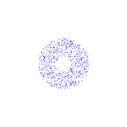
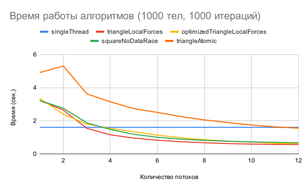
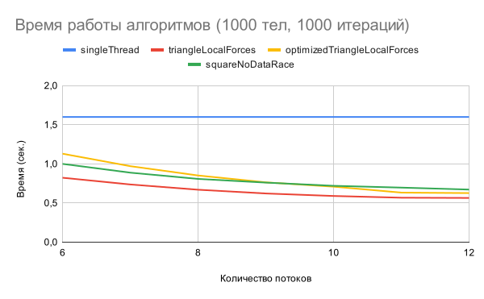
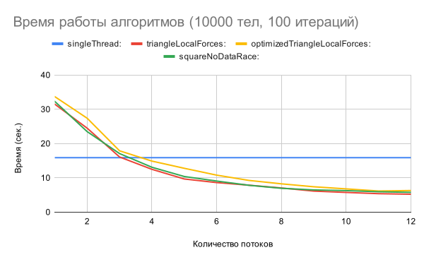
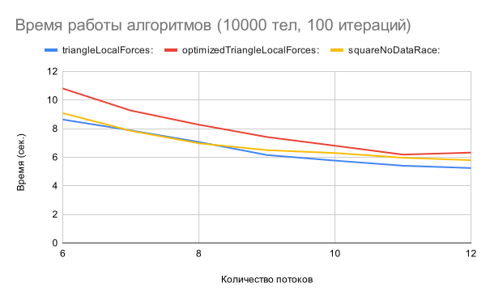

# Симуляция взаимодействия N тел в космосе

Данный репозиторий содержит программу предназначенную для симуляции взаимодействия множества тел в двухмерном пространстве под воздействием гравитационных сил. 

Имеется возможность генерировать GIF-анимацию и проводить замеры времени выполнения для различных методов (распаралеливания) симуляции.

Ниже представлена одна из сгенерированных GIF-анимаций.



# Требования

* Microsoft Visual Studio версии, поддерживающей OpenMP версии 2.0.

# Шаги по сборке

1. **Клонируйте репозиторий**:

```bash
git clonehttps://github.com/HottoPapurika/nBodyProblemOpenMp.git
cd nBodyProblemOpenMp
```

2. **Откройте проект в Visual Studio** (Откройте файл nBodyProblemOpenMp.sln).

3. **Настройте поддержку OpenMP**:

* Перейдите в Свойства проекта:
	* В меню Visual Studio выберите Project → Properties.

* Убедитесь, что для всех конфигураций (Debug, Release) и платформ включена поддержка OpenMP:
	* Project → Properties → C/C++ → Language → OpenMP support Yes.

4. **Соберите проект** (Сtrl+Shift+B).

5. **Перейдите в директорию с скомпилированной программой** (x64/Release и т.п.).


# Параметры командной строки

|Параметр|Описание |Значение по умолчанию|
|--------|---------|---------------------|
|-h, --help		   |Показать справочную информацию.	|
|-m, --method	   |Метод обновления симуляции. Возможные значения: singleThread, squareNoDataRace, triangleAtomic, triangleLocalForces, optimizedTriangleLocalForces, all.|	triangleLocalForces
|-g, --gif		   |Генерировать GIF-анимацию.|	0
|-t, --test	       |Запустить тестирование времени работы выбранного метода.|	0
|-n, --numThreads  |Количество потоков, используемых в симуляции.|	12
|-min, --minThreads|Минимальное количество потоков для тестирования.|	1
|-max, --maxThreads|Максимальное количество потоков для тестирования.|	12
|-f, --frames	   |Количество кадров (итераций симуляции).|	1000
|-nb, --numBodies  |Количество тел, участвующих в симуляции.|	1000
|-o, --output	   |Имя выходного файла (без расширения).|result

# Примеры использования
* Генерация GIF-анимации с 500 телами и 500 кадрами:

```bash
.\nBodyProblemOpenMp.exe -g -nb 500 -f 500 -o simulation
```
* Тестирование времени выполнения метода optimizedTriangleLocalForces с использованием потоков от 4 до 8:

```bash
.\nBodyProblemOpenMp.exe -t -m optimizedTriangleLocalForces -min 4 -max 8
```

# Результаты тестирования

### 1000 тел, 1000 итераций






Как видно выигрыш начинается с 4-х потоков. Лучше всех работает алгоритм triangleLocalForces, когда итерация идет по двум вложеным циклам в виде треугольника:

```cpp
#pragma omp parallel for schedule(dynamic)
for(int i=0;i<bodies.size();i++){
	for(int j=i+1<j.bodies.size();j++){
		//code
	}
}
```

Но выигрыш не такой большой в сравнении с другими алгоритмами вроде suareNoDataRace или optimizedTriangleLocalForces.

Кроме того, как видно из графиков, алгоритм optimizedTriangleLocalForces работает хуже чем, triangleLocalForces и это кажется странным. В optimizedTriangleLocalForces мы переходим от пространства двух индексов в пространство одного индекса k и можем использовать schedule(static), а не schedule(dynamic). Vector для перехода от индекса k к индексам i,j инициализируется один раз.