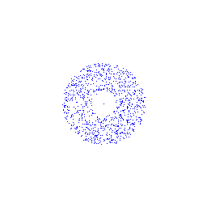

# Симуляция взаимодействия N тел в космосе

Данный репозиторий содержит программу предназначенную для симуляции взаимодействия множества тел в двухмерном пространстве под воздействием гравитационных сил. 

Имеется возможность генерировать GIF-анимацию и проводить замеры времени выполнения для различных методов (распаралеливания) симуляции.

Ниже изображен пример работы программы.



# Требования

* Microsoft Visual Studio версии, поддерживающей OpenMP версии 2.0.

# Шаги по сборке

1. **Клонируйте репозиторий**:

```bash
git clonehttps://github.com/HottoPapurika/nBodyProblemOpenMp.git
cd nBodyProblemOpenMp
```

2. **Откройте проект в Visual Studio** (Откройте файл nBodyProblemOpenMp.sln).

3. **Настройте поддержку OpenMP**:

* Перейдите в Свойства проекта:
	* В меню Visual Studio выберите Project → Properties.

* Убедитесь, что для всех конфигураций (Debug, Release) и платформ включена поддержка OpenMP:
	* Project → Properties → C/C++ → Language → OpenMP support Yes.

4. **Соберите проект** (Сtrl+Shift+B).

5. **Перейдите в директорию с скомпилированной программой** (x64/Release и т.п.).


# Функциональность
1. Запуск без параметров

```cmd
.\nBodyProblemOpenMp.exe
```

* Генерируется GIF-анимация (result.gif), состоящая из 1000 кадров, где отображается взаимодействие 1000 тел с временным шагом равным одному дню. Одно тело с очень большой массой находится в центре, а остальные распределены случайным образом равномерно вокруг него. Подробнее с методом генерации можно ознакомиться в файле Body.h.

2. Запуск с параметром (название метода)

```cmd
.\nBodyProblemOpenMp.exe param
```

* Выполняются симуляции (аналогичные той что выше) указанным методом на количестве потоков от 1 до omp_get_max_threads() с использованием OpenMP. Для каждого значения числа потоков симуляция запускается 10 раз, время работы усредняется и выводится в консоль.

# Параметра консоли (Методы симуляции)
* singleThread
* noDataRace

Методы описаны в файле Updaters.h. Их описание носит технический характер, поэтому я предлагаю просто ознакомиться соответствующим кодом.

